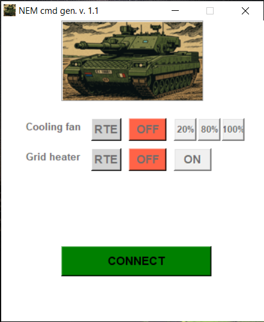

# NEM controller over UDS (automotive)
The following software was developed for controlling two specific NEM I/Os on the Ariete tank; more specifically, the grid heater and the motor fan.
The core features of the tool are layered on top of the UDS protocol stack, and hence standard J1939 frames are used in to send extended CAN messages to the ECU.
In order to correctly communicate on the CAN bus, a 2 channel ETAS ETAS582.X interface is used.
As final point, a CONFIG file was provided to select communication baudrate, interface channel and off timing of the grid heater.

### Technologies used: Python, ETAS582.X (CAN interface)

